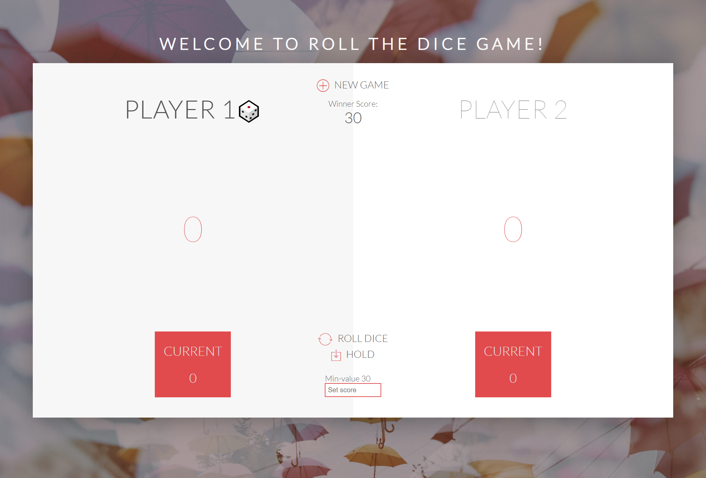

# ROLL THE DICE GAME - CHALLENGE
## JavaScript assignment - Change the game to follow these rules:

1. A Player looses his/her ENTIRE score when rolls two 6 in a roll, then the next player takes turn
2. Add an input field to the HTML to allow players to set the game's winning score
3. Add one more dice to the game so that there are two dices to play. The player looses his current score when on of the dices is 1.

## Start the game here
[Click to start](https://monksedo.github.io/diceChallenge/)

## Technology Used
HTML, CSS, and Javascript

## New JavaScript Verion
[View New Version](assets/js/diceChallenge.js)

## Previous Implementation
[View Code](assets/js/dicegameNew.js)
## Code Snippet
### Roll dice function

### Update score function

### Switch player & init() function

### Game Start Screen Shots

### Game in progress

### Player 1 loss all points with two 6

